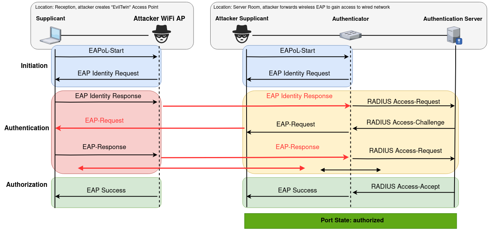

# EAP-Mirror PoC



## Usage

Edit `hostapd.conf` with the SSID to EvilTwin and correct wlan interface name of Access Point.

Connect to Ethernet port protected by 802.1x, run the script providing ethernet interface and mac address of that interface:

```shell
sudo python3 server.py eth1 38:14:28:b4:59:ca
```
The script needs to be run as root as it uses scapy to craft and send packets.

To be able to extract EAP packets sent by wireless clients and reply back we do two things:
1. Configure `hostapd` to connect to local RADIUS server and forward EAP packets to it
2. `server.py` creates RADIUS server locally to extracts EAP packets and sends them over Ethernet. It then parses replies from Ethernet and responds back to `hostapd`.

After `server.py` is running, launch `hostapd`:

```shell
sudo hostapd hostapd.conf
```

## Known Issues

Currently everything is processed in single thread and can only support one client, furthermore, if the client disconnects in the middle of authentication process `server.py` needs to be restarted as it catches a deadlock (due to how state transittions are implemented). 

After the successful authentication, the wireless client will be attempting to reconnect multiple times: it happens because we send EAP-success to the client, but don't attempt to negotiate session keys.

## Credits

Initial PoC by Pavel Yakovlev, further testing in collaboration with Alexander Volkov. 
